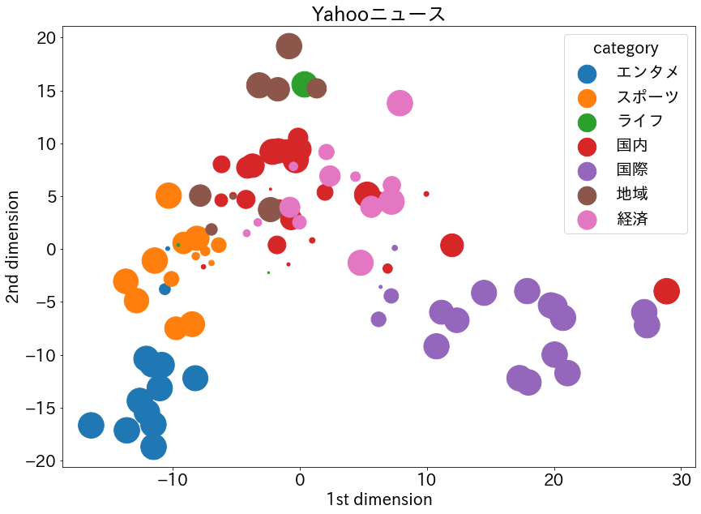
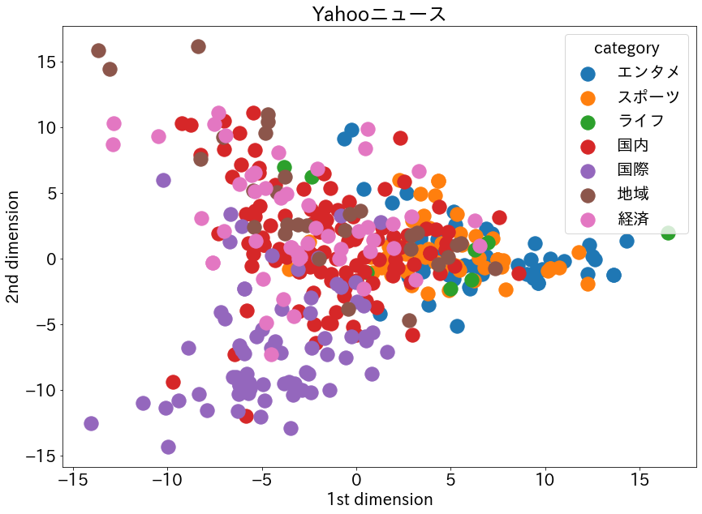
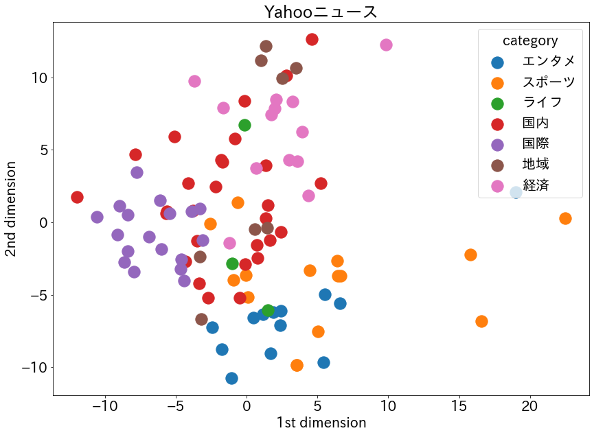

[前回](https://qiita.com/kei0919/items/3059c336c3d0e2228830)はYahooニュースの記事データに対して、fastTextのtrain_supervisedメソッドを使って教師あり学習を行い、クラスタリングを行いました。  
今回はfastTextのtrain_unsupervisedメソッドを使って教師なし学習を行い、前回の様に綺麗にクラスタリングできるか分析してみましょう。

## 開発環境
- [Docker](https://github.com/adachi0919/analysis001/blob/master/dock1/Dockerfile)
- JupyterLab

## 実装スタート
①ライブラリ読み込み  
②[utility.py](https://github.com/adachi0919/analysis001/blob/master/work/analysis/utility.py)と言うファイルを作成して、今まで作成した関数を格納しています。そこから、今回必要な関数を読み込みます。  
③YN関数を使ってYahooニュースの記事を取得します。約10で500記事ほど取得できます。この関数は[こちら](https://qiita.com/kei0919/items/780b36f14907412f3489)で紹介しています。


```python
# ①
import pandas as pd, numpy as np
from sklearn.model_selection import train_test_split
import fasttext
from sklearn import preprocessing
from sklearn.decomposition import PCA
import matplotlib.pyplot as plt
import japanize_matplotlib
import re
```


```python
# ②
import utility as util 
wakati = util.wakati
M2A = util.MecabMorphologicalAnalysis
YN = util.YahooNews
cos_sim = util.cos_sim
```


```python
# ③
df = YN(1000)
# df = pd.read_csv('./YahooNews.csv') # すでにデータを取得済の場合は読み込んで分析スタート！
df
```

    [====================] 502記事


<div>
<style scoped>
    .dataframe tbody tr th:only-of-type {
        vertical-align: middle;
    }

    .dataframe tbody tr th {
        vertical-align: top;
    }

    .dataframe thead th {
        text-align: right;
    }
</style>
<table border="1" class="dataframe">
  <thead>
    <tr style="text-align: right;">
      <th></th>
      <th>title</th>
      <th>category</th>
      <th>text</th>
    </tr>
  </thead>
  <tbody>
    <tr>
      <th>0</th>
      <td>パナ 22年に持ち株会社へ移行</td>
      <td>経済</td>
      <td>ブルームバーグ パナソニックは13日2022年4月から持ち株会社体制に移行すると発表した社名...</td>
    </tr>
    <tr>
      <th>1</th>
      <td>全国で1700人超感染 過去最多</td>
      <td>国内</td>
      <td>Nippon News NetworkNNN新型コロナウイルスの13日一日の新たな感染者はN...</td>
    </tr>
    <tr>
      <th>2</th>
      <td>眞子さまの結婚 両陛下も尊重</td>
      <td>国内</td>
      <td>宮内庁は13日秋篠宮ご夫妻の長女眞子さまと国際基督教大学ICU時代の同級生小室圭さん29と...</td>
    </tr>
    <tr>
      <th>3</th>
      <td>トランプ氏 子の助言分かれる</td>
      <td>国際</td>
      <td>CNN 米大統領選で敗北が確実となったトランプ大統領が次の一手の戦略を練るなか同氏の最も信頼...</td>
    </tr>
    <tr>
      <th>4</th>
      <td>国交相「GoTo延長したい」</td>
      <td>国内</td>
      <td>CopyrightC Japan News Network All rights reser...</td>
    </tr>
    <tr>
      <th>...</th>
      <td>...</td>
      <td>...</td>
      <td>...</td>
    </tr>
    <tr>
      <th>497</th>
      <td>バイデン氏 国民向けTV演説へ</td>
      <td>国際</td>
      <td>AFP時事米民主党の大統領候補ジョーバイデンJoe Biden氏が6日夜日本時間7日午前国民...</td>
    </tr>
    <tr>
      <th>498</th>
      <td>全米各地で衝突や暴動警戒</td>
      <td>国際</td>
      <td>All Nippon NewsNetworkANN アメリカでは大統領選挙の勝者が確定しない...</td>
    </tr>
    <tr>
      <th>499</th>
      <td>日中ビジネス往来 再開で合意</td>
      <td>国内</td>
      <td>日中両政府が新型コロナウイルス対策のため制限しているビジネス関係者らの往来を今月中旬にも再...</td>
    </tr>
    <tr>
      <th>500</th>
      <td>大統領選 ジョージア再集計へ</td>
      <td>国際</td>
      <td>AFP時事更新米大統領選で民主党のジョーバイデンJoe Biden氏が共和党のドナルドトラン...</td>
    </tr>
    <tr>
      <th>501</th>
      <td>IOCバッハ会長 15日に来日へ</td>
      <td>スポーツ</td>
      <td>来夏に延期された東京五輪パラリンピックをめぐり国際オリンピック委員会IOCのトーマスバッハ...</td>
    </tr>
  </tbody>
</table>
<p>502 rows × 3 columns</p>
</div>


## subwordについて
前回は触れなかったのですが、今回はfastTextの大きな特徴であるsubwordを考慮してみようと思います。  
subwordとは単語をさらに細かな「部分語」に分割して単語の関連性を捉えようと言うものです。  
例えば「Go」と「Going」の様な共通部分を持つ語句について、その関連性を学習できます。  
subwordを適応すると精度が上がったので使用しようと思います。逆にカタカタ語に対しては弊害もある様です。  
train_supervisedやtrain_unsupervisedの引数に`maxn`と`minn`を渡すことで実装できます。  
train_supervisedとtrain_unsupervisedでデフォルト値が異なります。詳しくは[GitHub](https://github.com/facebookresearch/fastText/tree/master/python#train_unsupervised-parameters)へ。

## 教師あり学習(train_supervised)
まずは、比較のために[前回](https://qiita.com/kei0919/items/3059c336c3d0e2228830)の内容を一気に実行。  


```python
# カテゴリと本文をそれぞれリストに格納
cat_lst = ['__label__' + cat for cat in df.category]
text_lst = [M2A(text, mecab=wakati) for text in df.text]

# trainとvalidに分割
text_train, text_valid, cat_train, cat_valid = train_test_split(
    text_lst, cat_lst, test_size=0.2, random_state=0, stratify=cat_lst
)

# trainファイルとvalidファイル作成
with open('./s_train', mode='w') as f:
    for i in range(len(text_train)):
        f.write(cat_train[i] + ' '+ text_train[i])
        
with open('./s_valid', mode='w') as f:
    for i in range(len(text_valid)):
        f.write(cat_valid[i] + ' ' + text_valid[i])

# モデルの学習
model = fasttext.train_supervised(input='./s_train', lr=0.5, epoch=500, minn=3, maxn=5,
                                  wordNgrams=3, loss='ova', dim=300, bucket=200000)

# モデルの精度を確認
# print("TrainData:", model.test('./s_news_train'))
print("ValidData:", model.test('./s_valid'))

# validデータを使って2次元プロットの準備
with open("./s_valid") as f:
    l_strip = [s.strip() for s in f.readlines()] # strip()を利用することにより改行文字除去
    
labels = []
texts = []
sizes = []
for t in l_strip:
    labels.append(re.findall('__label__(.*?) ', t)[0])
    texts.append(re.findall(' (.*)', t)[0])
    sizes.append(model.predict(re.findall(' (.*)', t))[1][0][0])

# validの記事本文からベクトル生成
vectors = []
for t in texts:
    vectors.append(model.get_sentence_vector(t))

# numpyに変換
vectors = np.array(vectors)
labels = np.array(labels)
sizes = np.array(sizes)

# 標準化
ss = preprocessing.StandardScaler()
vectors_std = ss.fit_transform(vectors)

# 次元削減
pca = PCA()
pca.fit(vectors_std)
feature = pca.transform(vectors_std)
feature = feature[:, :2]

# プロット
x0, y0, z0 = feature[labels=='エンタメ', 0], feature[labels=='エンタメ', 1], sizes[labels=='エンタメ']*1000
x1, y1, z1 = feature[labels=='スポーツ', 0], feature[labels=='スポーツ', 1], sizes[labels=='スポーツ']*1000
x2, y2, z2 = feature[labels=='ライフ', 0], feature[labels=='ライフ', 1], sizes[labels=='ライフ']*1000
x3, y3, z3 = feature[labels=='国内', 0], feature[labels=='国内', 1], sizes[labels=='国内']*1000
x4, y4, z4 = feature[labels=='国際', 0], feature[labels=='国際', 1], sizes[labels=='国際']*1000
x5, y5, z5 = feature[labels=='地域', 0], feature[labels=='地域', 1], sizes[labels=='地域']*1000
x6, y6, z6 = feature[labels=='経済', 0], feature[labels=='経済', 1], sizes[labels=='経済']*1000

plt.figure(figsize=(14, 10))
plt.rcParams["font.size"]=20
plt.scatter(x0, y0, label="エンタメ", s=z0)
plt.scatter(x1, y1, label="スポーツ", s=z1)
plt.scatter(x2, y2, label="ライフ", s=z2)
plt.scatter(x3, y3, label="国内", s=z3)
plt.scatter(x4, y4, label="国際", s=z4)
plt.scatter(x5, y5, label="地域", s=z5)
plt.scatter(x6, y6, label="経済", s=z6)
plt.title("Yahooニュース")
plt.xlabel('1st dimension')
plt.ylabel('2nd dimension')
plt.legend(title="category")
plt.show()
```

    ValidData: (101, 0.801980198019802, 0.801980198019802)





## 教師なし学習(train_unsupervised)
### データの準備
教師なし学習にはラベルが必要ないので、学習するためのデータは分かち書きしておくだけでOKです。
①カテゴリはcat_lstへ、文章はM2A関数で分かち書きしてtext_lstへそれぞれ格納します。  
②trainデータとvalidデータに分割します。  
③文章はファイルに保存しておきます。


```python
# ①
cat_lst = [cat for cat in df.category]
text_lst = [M2A(text, mecab=wakati) for text in df.text]

# ②
text_train, text_valid, cat_train, cat_valid = train_test_split(
    text_lst, cat_lst, test_size=0.2, random_state=0, stratify=cat_lst
)

# ③
with open('./u_train', mode='w') as f:
    for i in range(len(text_train)):
        f.write(text_train[i])
        
with open('./u_valid', mode='w') as f:
    for i in range(len(text_valid)):
        f.write(text_valid[i])
```

### モデルの学習

教師なし学習は`train_unsupervised`を使用します。  


```python
model = fasttext.train_unsupervised('./u_train', epoch=500, lr=0.01, minn=3, maxn=5, dim=300)
```

### trainデータ分析
#### 文章ベクトルの類似度比較
学習済モデルを使用して、記事内容の類似度を算出しましょう。  
①`get_sentence_vector`メソッドを使用して学習済モデルから文章ベクトルを生成します。  
②記事のカテゴリと本文を表示。  
③上で読み込んだ`cos_sim`関数を用いてコサイン類似度を算出。


```python
# ①
vectors = []
for t in text_train:
    vectors.append(model.get_sentence_vector(t.strip()))

# ②
print("<{}>".format(cat_train[0]))
print(text_train[0][:200], end="\n\n")
print("<{}>".format(cat_train[1]))
print(text_train[1][:200], end="\n\n")
print("<{}>".format(cat_train[2]))
print(text_train[2][:200], end="\n\n")

# ③
print("<{}><{}>".format(cat_train[0], cat_train[1]), cos_sim(vectors[0], vectors[1]))
print("<{}><{}>".format(cat_train[1], cat_train[2]), cos_sim(vectors[1], vectors[2]))
print("<{}><{}>".format(cat_train[0], cat_train[2]), cos_sim(vectors[0], vectors[2]))
```

    <国内>
    政府 の 新型コロナ ウイルス対策 分科会 の 尾身茂 会長 地域医療機能推進機構 理事長 は 9日 緊急 で 記者会見 を 開き 感染 が 全国的 に 見 て も 増加 し て いる の は 間違い ない 減少 要因 を 早急 に 強め なけれ ば いま は 徐々に だ が 急速 な 拡大 傾向 に 至る 可能性 が 高い と 訴え た そして 政府 へ の 緊急 提言 として 1 いま まで 
    
    <国内>
    昨年7月 の 参院選 を めぐり 公職選挙法違反 買収 の 罪 に 問わ れ た 参院 議員 河井案里 被告 47 の 被告人 質問 が 13日 午前 東京地裁 で 始まっ た 案 里 議員 は 地元 議員 ら に 現金 を 渡し た こと について 当選 祝い や 陣中 見舞い だっ た と 初公判 で 述べ た 主張 を 繰り返し 違法性 が ない と 訴え た スーツ姿 の 案 里 議員 は
    
    <国際>
    AFP 時事 更新 ドナルドトランプ Donald Trump 米大統領 は 9日 ツイッター Twitter へ の 投稿 で マークエスパー Mark Esper 国防長官 を 解任 し た こと を 明らか に し た 大統領選 で の 敗北 を 認め ない トランプ氏 へ の 対応 に 追わ れる 政権 に さらなる 揺さぶり が かけ られ た トランプ氏 は 投稿 で マークエスパー 
    
    <国内><国内> 0.91201633
    <国内><国際> 0.9294117
    <国内><国際> 0.9201762


#### 2次元プロット
いよいよ2次元にプロットしてみましょう。  
①ベクトルとラベルをそれぞれnumpy配列に変換  
②ベクトルを標準化  
③ベクトルをPCAを用いて次元削減  
④matplotlibでプロット。`train_supervised`と異なり、予測に対する確率を取得できないので、全てのプロットのサイズは同じ。


```python
# ①
vectors = np.array(vectors)
labels = np.array(cat_train)


# ②
ss = preprocessing.StandardScaler()
vectors_std = ss.fit_transform(vectors)


# ③
pca = PCA()
pca.fit(vectors_std)
feature = pca.transform(vectors_std)
feature = feature[:, :2]


# ④
x0, y0 = feature[labels=='エンタメ', 0], feature[labels=='エンタメ', 1]
x1, y1 = feature[labels=='スポーツ', 0], feature[labels=='スポーツ', 1]
x2, y2 = feature[labels=='ライフ', 0], feature[labels=='ライフ', 1]
x3, y3 = feature[labels=='国内', 0], feature[labels=='国内', 1]
x4, y4 = feature[labels=='国際', 0], feature[labels=='国際', 1]
x5, y5 = feature[labels=='地域', 0], feature[labels=='地域', 1]
x6, y6 = feature[labels=='経済', 0], feature[labels=='経済', 1]

plt.figure(figsize=(14, 10))
plt.rcParams["font.size"]=20
plt.scatter(x0, y0, label="エンタメ", s=300)
plt.scatter(x1, y1, label="スポーツ", s=300)
plt.scatter(x2, y2, label="ライフ", s=300)
plt.scatter(x3, y3, label="国内", s=300)
plt.scatter(x4, y4, label="国際", s=300)
plt.scatter(x5, y5, label="地域", s=300)
plt.scatter(x6, y6, label="経済", s=300)
plt.title("Yahooニュース")
plt.xlabel('1st dimension')
plt.ylabel('2nd dimension')
plt.legend(title="category")
plt.show()
```





### validデータ分析
次に、validデータをクラスタリングしてみます。  
内容はtrainデータ分析と同じですので解説を省略します。


```python
vectors = []
for t in text_valid:
    vectors.append(model.get_sentence_vector(t.strip()))

print("<{}>".format(cat_valid[0]))
print(text_valid[0][:200], end="\n\n")
print("<{}>".format(cat_valid[1]))
print(text_valid[1][:200], end="\n\n")
print("<{}>".format(cat_valid[2]))
print(text_valid[2][:200], end="\n\n")
print("<{}><{}>".format(cat_valid[0], cat_valid[1]), cos_sim(vectors[0], vectors[1]))
print("<{}><{}>".format(cat_valid[1], cat_valid[2]), cos_sim(vectors[1], vectors[2]))
print("<{}><{}>".format(cat_valid[0], cat_valid[2]), cos_sim(vectors[0], vectors[2]))
```

    <経済>
    近畿日本ツーリスト など を 傘下 に 持つ KNT ― CT ホールディングス HD は 11日 希望退職 など で グループ 従業員 約 7000人 の 3分の1 を 2025年 3月 まで に 削減 する と 発表 し た 個人旅行 を 扱う 全国 138 の 店舗 も 3分の2 を 22年 3月 まで に 閉鎖 する 新型コロナウイルス 感染拡大 に 伴う 旅行 需要 の 激減 で 業績 
    
    <地域>
    北海道 の 新型コロナウイルス へ の 感染者 が 11月9日 過去最多 200人 を 超える 見通し と なっ た こと が わかり まし た 5日 連続 の 100人 超 が ついに 200人 台 へ の 到達 見込み と なり 感染拡大 が 止まり ませ ん 新た な クラスター が 確認 さ れ て いる と み られ ます 北海道 で は 5日 に 119人 の 感染者 が 確認 さ れ
    
    <経済>
    日立製作所 は 9日 年末年始 の 休暇 の 分散 取得 など を 求める 政府 の 方針 を 受け 12月28日 来年 1月8日 まで を 対象 期間 と し 有休 取得 を 促す と 発表 し た 通常 は 12月30日 から 1月3日 まで グループ会社 の 社員 を 含む 約 15万人 が 対象 で 社内 の 年末年始 行事 や 不要不急 の 会議 の 開催 を 避け 休暇 を 取得 し 
    
    <経済><地域> 0.9284181
    <地域><経済> 0.90896636
    <経済><経済> 0.9533808


```python
vectors = np.array(vectors)
labels = np.array(cat_valid)

ss = preprocessing.StandardScaler()
vectors_std = ss.fit_transform(vectors)

pca = PCA()
pca.fit(vectors_std)
feature = pca.transform(vectors_std)
feature = feature[:, :2]

x0, y0 = feature[labels=='エンタメ', 0], feature[labels=='エンタメ', 1]
x1, y1 = feature[labels=='スポーツ', 0], feature[labels=='スポーツ', 1]
x2, y2 = feature[labels=='ライフ', 0], feature[labels=='ライフ', 1]
x3, y3 = feature[labels=='国内', 0], feature[labels=='国内', 1]
x4, y4 = feature[labels=='国際', 0], feature[labels=='国際', 1]
x5, y5 = feature[labels=='地域', 0], feature[labels=='地域', 1]
x6, y6 = feature[labels=='経済', 0], feature[labels=='経済', 1]

plt.figure(figsize=(14, 10))
plt.rcParams["font.size"]=20
plt.scatter(x0, y0, label="エンタメ", s=300)
plt.scatter(x1, y1, label="スポーツ", s=300)
plt.scatter(x2, y2, label="ライフ", s=300)
plt.scatter(x3, y3, label="国内", s=300)
plt.scatter(x4, y4, label="国際", s=300)
plt.scatter(x5, y5, label="地域", s=300)
plt.scatter(x6, y6, label="経済", s=300)
plt.title("Yahooニュース")
plt.xlabel('1st dimension')
plt.ylabel('2nd dimension')
plt.legend(title="category")
plt.show()
```





## 考察
### 教師あり学習 
- subwordを採用したことで、前回記事の時よりさらに精度が向上しました。0.75→0.80
- 前回同様、1次元目では「エンタメ」と「スポーツ」は重なる部分が多いが、2次元目でしっかり分かれている。「エンタメ」と「スポーツ」が近い位置にあるのは納得。
- 「国際」と「国内」もしっかり分かれており、その間に「経済」がある。前回同様これも納得。
- 前回記事において「地域」ははっきりしていなかったが、今回は2次元方向に特徴が強く出ている。
- 全体として前回よりもはっきり分類された感じがします。

### 教師なし学習
#### trainデータ
- カテゴリごとに重なっている部分が多い。
- 「国際」と「国内」はしっかり分かれている。
- 「経済」は「国際」と「国内」の間にあると言うのがお決まりのパターンであったが、今回は広い範囲にプロットされてしまっている。
- 「エンタメ」と「スポーツ」はかなりの部分が重なっているが、一次元方向において「エンタメ」が若干右より、「スポーツ」が左に位置した。
- 「地域」は「国際」と重なる部分がほとんどなく、これは納得。「国内」、「経済」とかなりの部分が重なっている。

#### validデータ
- 重なっている部分が少なく、全体として綺麗に分類された。
- 中央に「国内」があり、左側に「国際」、中央上に「経済」と言う配置になった。今までとは随分違う。
- 今回も「スポーツ」と「エンタメ」はかなり近い位置にあるが、若干「スポーツ」が広い範囲に分布した。
- 「地域」は2つに分かれている。この傾向は、教師あり学習の方でも見て取れるため、何かの基準があるかもしれない。

今回は教師なし学習で分析を行いましたが、割と綺麗に分類が成功していて驚きました。  
ラベルがないので、文章の中から「国際」っぽさや「スポーツ」っぽさを取得できていると言うことになります。実際にモデルがどの様な特徴を取得して、ベクトル作成に反映させているのか非常に気になります。  
fastTextについてさらに深掘りしてみたくなりました！！！
        

## 参考文献
[Yahoo!ニュース](https://news.yahoo.co.jp/topics/top-picks)  
[fastText](https://fasttext.cc/)  
[Facebookが公開したfastTextのインストールと使用方法について解説](https://blog.formzu.com/install_fasttext)  
[fastTextのsubword(部分語)の弊害](https://studylog.hateblo.jp/entry/2016/09/20/103724)
[fastText tutorial(Word representations)](https://fasttext.cc/docs/en/unsupervised-tutorial.html)  
[GitHub (fastText/python)](https://github.com/facebookresearch/fastText/tree/master/python)  
[fastTextがすごい！「Yahoo!ニュース」をクラスタリング](https://qiita.com/kei0919/items/3059c336c3d0e2228830)  

